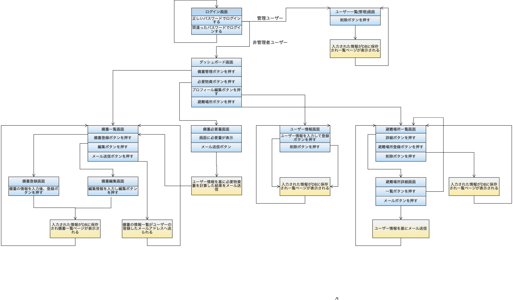

# 卒業課題
## 開発言語バージョン
 - rails 6.1.7
 - ruby 3.0.1

## 就業Termで学んだ技術
 - devise
 - AWS EC2

## カリキュラム外技術
 - GeoJSON API (CSV フォーマットのデータを GitHub Actions で GeoJSON に変換し API として公開するAPI)
 - Community Geocoder(住所から緯度経度を検索)
 - Embed API(Geoloniaの地図を表示するAPI)

 ## アプリケーションの実行手順
  `git clone git@github.com:ogura820/guadiant.git`  
  `cd guadiant`  
  `rails db:create`  
  `rails db:migrate`   
  `bundle install`  
  `yarn install`  
  `rails s`  

## チェックシート、カタログ設計、テーブル定義書、ワイヤーフレームの共有リンク
  [チェックシート](https://docs.google.com/spreadsheets/d/1H91Bz-mZM60--Tnp-9YRwAM2L4hyuuqdyd0sG46FNa8/edit#gid=1704578196)
  [カタログ設計](https://docs.google.com/spreadsheets/d/1H91Bz-mZM60--Tnp-9YRwAM2L4hyuuqdyd0sG46FNa8/edit?usp=sharing)  
  [テーブル定義書](https://docs.google.com/spreadsheets/d/1H91Bz-mZM60--Tnp-9YRwAM2L4hyuuqdyd0sG46FNa8/edit?usp=sharing)  
  [ワイヤーフレーム](https://cacoo.com/diagrams/8LEMFC6PxzdiIDpp/DC8E6)

##  ER図、、画面遷移図の画像
    
  